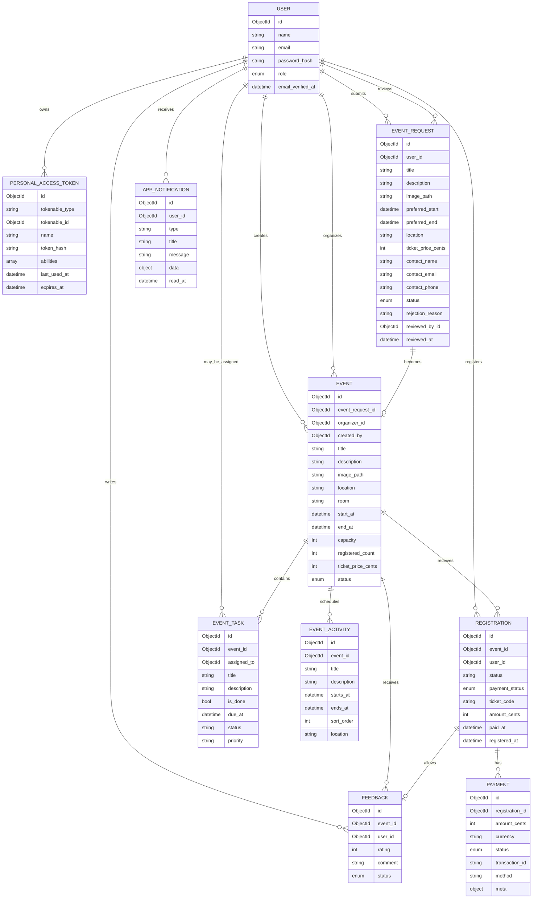

# Merise Documentation

This document describes the backend with Merise-style views:

- MCD: conceptual data model, focused on entities and business relationships.
- MLD: logical data model, focused on Mongo collections, fields, and indexes.
- MCT: conceptual treatment model, focused on events, operations, rules, and results.

The implementation is MongoDB-only, so the MLD uses collections instead of SQL tables. Relationship fields are stored as Mongo ObjectId strings in fields such as `event_id`, `user_id`, and `registration_id`.

## MCD - Conceptual Data Model

## MCD Cardinalities

| Association | Cardinality | Meaning |
| --- | --- | --- |
| User - PersonalAccessToken | one user to zero or many tokens | A user can have many API tokens. A token belongs to one user. |
| User - EventRequest | one client to zero or many requests | A client can submit requests. A request has one submitting client. |
| User - EventRequest review | one admin to zero or many reviewed requests | A reviewed request can reference the admin who reviewed it. |
| EventRequest - Event | one request to zero or one event | Approval creates one draft event. Rejection creates no event. |
| User - Event creator | one user to zero or many created events | An admin or organizer can create events. |
| User - Event organizer | one organizer to zero or many assigned events | An event may be unassigned until an admin assigns an organizer. |
| Event - EventTask | one event to zero or many tasks | Tasks belong to one event. |
| Event - EventActivity | one event to zero or many activities | Activities belong to one event timeline. |
| Event - Registration | one event to zero or many registrations | Registrations count toward event capacity. |
| User - Registration | one participant to zero or many registrations | A participant can register once per event. |
| Registration - Payment | one registration to zero or many payments | Free events create a completed free payment; paid events create a payment when paid. |
| Event - Feedback | one event to zero or many feedbacks | Feedback is attached to an event. |
| User - Feedback | one participant to zero or many feedbacks | A participant can leave one feedback per event. |
| Registration - Feedback | one paid attended registration enables zero or one feedback | Feedback is only accepted from eligible participants. |
| User - AppNotification | one user to zero or many notifications | Notifications are stored per recipient. |

## MLD - Logical Mongo Collections

### `users`

Purpose: authentication identity and role ownership.

Fields:

- `_id`: Mongo ObjectId.
- `name`: user display name.
- `email`: unique login email.
- `password`: hashed password.
- `role`: one of `admin`, `organizer`, `participant`, `client`.
- `email_verified_at`, `remember_token`, `created_at`, `updated_at`.

Indexes:

- `users_email_unique`: unique email lookup for login and duplicate prevention.
- `users_role_idx`: role filtering for admin user management.

### `personal_access_tokens`

Purpose: Sanctum bearer tokens stored in MongoDB.

Fields:

- `_id`: Mongo ObjectId.
- `tokenable_type`, `tokenable_id`: token owner.
- `name`: token label, currently `spa`.
- `token`: hashed token value.
- `abilities`: token abilities.
- `last_used_at`, `expires_at`, `created_at`, `updated_at`.

Indexes:

- `tokens_token_unique`: token lookup.
- `tokens_tokenable_idx`: token owner lookup.
- `tokens_expires_at_idx`: token expiration cleanup support.

### `event_requests`

Purpose: client proposals before they become managed events.

Fields:

- `_id`.
- `user_id`: client.
- `title`, `description`, `image_path`, `location`.
- `preferred_start`, `preferred_end`.
- `ticket_price_cents`.
- `contact_name`, `contact_email`, `contact_phone`.
- `status`: `pending`, `approved`, `rejected`.
- `rejection_reason`.
- `reviewed_by_id`, `reviewed_at`.
- timestamps.

Indexes:

- `event_requests_contact_status_idx`: client request lookup by contact/status.
- `event_requests_status_created_idx`: admin moderation list.

### `events`

Purpose: concrete events managed by organizers and admins.

Fields:

- `_id`.
- `event_request_id`: nullable source request.
- `organizer_id`: nullable assigned organizer.
- `created_by`: user who created the event.
- `title`, `description`, `image_path`, `location`, `room`.
- `start_at`, `end_at`.
- `capacity`, `registered_count`.
- `ticket_price_cents`.
- `status`: `draft`, `pending_publication`, `published`, `cancelled`, `completed`.
- timestamps.

Indexes:

- `events_event_request_unique`: one event per approved request.
- `events_status_start_idx`: public browsing and active event checks.
- `events_organizer_status_idx`: organizer dashboards.
- `events_creator_status_idx`: admin/organizer "created by me" dashboards.

### `event_tasks`

Purpose: internal preparation tasks for managed events.

Fields:

- `_id`.
- `event_id`.
- `assigned_to`: optional user assignment.
- `title`, `description`.
- `is_done`, `due_at`.
- `status`, `priority`.
- timestamps.

Index:

- `event_tasks_event_due_idx`: event task lists ordered by due date.

### `event_activities`

Purpose: public or internal event timeline items.

Fields:

- `_id`.
- `event_id`.
- `title`, `description`.
- `starts_at`, `ends_at`.
- `sort_order`, `location`.
- timestamps.

Index:

- `event_activities_event_order_idx`: event schedule ordering.

### `registrations`

Purpose: participant booking and ticket state.

Fields:

- `_id`.
- `event_id`.
- `user_id`.
- `ticket_type`.
- `status`: currently `registered`.
- `payment_status`: `pending` or `paid`.
- `ticket_code`: unique ticket identifier.
- `amount_cents`.
- `paid_at`, `registered_at`.
- timestamps.

Indexes:

- `registrations_event_user_unique`: prevents duplicate event registration.
- `registrations_user_payment_idx`: participant history filtering.
- `registrations_event_payment_idx`: event registration management.
- `registrations_ticket_code_unique`: ticket uniqueness.

### `payments`

Purpose: payment ledger for registrations.

Fields:

- `_id`.
- `registration_id`.
- `amount_cents`.
- `currency`.
- `status`: `completed` for current mock/free flows.
- `transaction_id`.
- `method`: `free` or `card_mock`.
- `meta`.
- timestamps.

Indexes:

- `payments_registration_idx`: lookup by registration.
- `payments_status_idx`: revenue/statistics queries.

### `feedbacks`

Purpose: moderated participant feedback.

Fields:

- `_id`.
- `event_id`.
- `user_id`.
- `rating`.
- `comment`.
- `status`: `pending` or `approved`.
- timestamps.

Indexes:

- `feedbacks_event_user_unique`: one feedback per user per event.
- `feedbacks_event_status_idx`: public approved feedback lists.

### `app_notifications`

Purpose: in-app notification inbox.

Fields:

- `_id`.
- `user_id`.
- `type`.
- `title`.
- `message`.
- `data`.
- `read_at`.
- timestamps.

Index:

- `notifications_user_read_created_idx`: unread counts and notification lists.

## MCT - Conceptual Treatment Model

### Auth And Identity

| External Event | Operation | Business Rules | Result |
| --- | --- | --- | --- |
| User submits registration form | Create account | Role must be `participant` or `client`; email must be unique; password is hashed | User and bearer token are created |
| User submits login form | Authenticate | Email and password must match a stored user; login is rate limited | Bearer token is created |
| User requests `/api/user` | Identify token owner | Bearer token must be valid | Current user is returned |
| User logs out | Revoke token | Request must be authenticated | Current token is deleted |

### Client Event Request

| External Event | Operation | Business Rules | Result |
| --- | --- | --- | --- |
| Client submits event request | Validate and store request | Client cannot already have a pending request or active event; image must be valid if supplied | Pending request is created |
| Client deletes request | Delete pending request | Client must own the request; reviewed requests cannot be deleted | Request and image are removed |
| Admin lists requests | Filter moderation queue | Optional status filter must be valid | Requests are returned newest first |

### Event Request Review

| External Event | Operation | Business Rules | Result |
| --- | --- | --- | --- |
| Admin approves request | Mark request approved and create event | Request must still be pending; operation is transactional | Request becomes approved and a draft event is created |
| Admin rejects request | Mark request rejected | Request must still be pending; rejection reason required for rejection | Request becomes rejected |

### Event Management

| External Event | Operation | Business Rules | Result |
| --- | --- | --- | --- |
| Organizer creates event | Create draft event | Organizer cannot directly publish | Draft event is created |
| Admin creates event | Create event | Admin may create published event | Event is created with requested status |
| Organizer updates event | Update managed event | Organizer must own or have created the event; organizer cannot publish directly | Event is updated |
| Admin assigns organizer | Assign event owner | Assigned user must be organizer | Event organizer changes |
| Organizer requests publication | Move event to pending publication | Event must be manageable by organizer | Admin approval becomes required |
| Admin approves publication | Publish event | Event must be pending publication or draft according to service rules | Event becomes published |
| Manager changes capacity | Update capacity | Capacity cannot be lower than `registered_count` | Capacity changes |

### Event Planning

| External Event | Operation | Business Rules | Result |
| --- | --- | --- | --- |
| Manager creates task | Add preparation task | Actor must manage event | Task is stored |
| Manager updates task | Modify task | Task must belong to route event | Task is updated |
| Manager deletes task | Remove task | Task must belong to route event | Task is deleted |
| Manager creates activity | Add schedule item | Start/end dates must be valid | Activity is stored |
| Manager updates activity | Modify schedule item | Activity must belong to route event | Activity is updated |
| Manager deletes activity | Remove schedule item | Activity must belong to route event | Activity is deleted |

### Registration And Payment

| External Event | Operation | Business Rules | Result |
| --- | --- | --- | --- |
| Participant registers | Create registration | Event must be published; capacity must remain available; participant cannot duplicate registration | Registration is created and event count increments |
| Free event registration succeeds | Create free payment | Amount is zero or less | Registration is immediately paid and free payment is stored |
| Participant pays | Mock payment | Registration must be pending | Registration becomes paid and payment is stored |
| Participant cancels | Delete own registration | Registration must be unpaid | Registration is removed and event count decrements |
| Participant downloads ticket | Build ticket payload | Registration must be paid and owned by participant | JSON ticket is returned |
| Staff deletes registration | Delete unpaid registration | Staff must manage event; registration must be unpaid | Registration is removed and count decrements |

### Feedback And Notifications

| External Event | Operation | Business Rules | Result |
| --- | --- | --- | --- |
| Participant submits feedback | Store pending feedback | Participant must have paid registration; one feedback per event | Pending feedback is created |
| Admin approves feedback | Publish feedback | Admin only | Feedback becomes approved and notifications are sent |
| Admin deletes feedback | Remove feedback | Admin only | Feedback is deleted |
| User opens notifications | List inbox | User sees only own notifications | Notifications are returned |
| User marks notification read | Update read state | Notification must belong to user | `read_at` is set |

### Stats

| External Event | Operation | Business Rules | Result |
| --- | --- | --- | --- |
| Admin opens dashboard | Aggregate global stats | Admin only | Counts, revenue, pending work, and event data are returned |
| Client opens stats | Aggregate client stats | Client only; only owned/requested events are included | Request groups, event lists, and revenue are returned |

## Merise Notes For This Mongo Implementation

Classic Merise often assumes a relational database. This backend keeps the Merise analysis but maps the MLD to Mongo collections:

- primary keys are Mongo ObjectIds;
- foreign keys are ObjectId string fields;
- referential integrity is enforced by services and tests, not SQL constraints;
- uniqueness and query performance are enforced by Mongo indexes;
- transactions are used for workflows where several documents must change together.
