# UML Workflow Documentation

This file documents the main application workflows with UML-style Mermaid diagrams. It is intended for developers who need to understand the behavior before reading the PHP files.

Mermaid is used so the diagrams remain versionable in Git. Most diagrams use sequence or activity-style flowcharts because the backend is workflow-heavy.

## Global Use-Case View

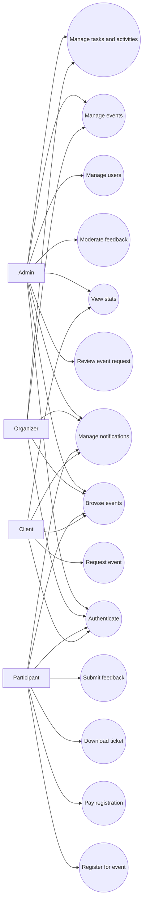

## 1. Registration Workflow

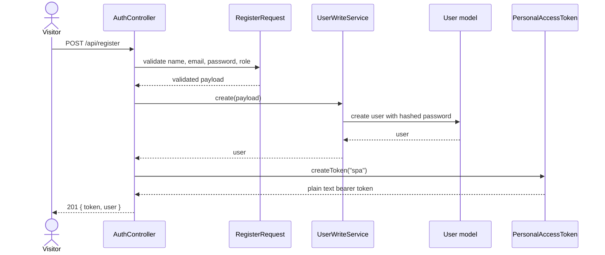

Rules:

- Public users can register only as `participant` or `client`.
- Admin and organizer accounts are created by an admin or by seed data.
- The `users_email_unique` Mongo index prevents duplicate emails.

## 2. Login And Token Authentication Workflow

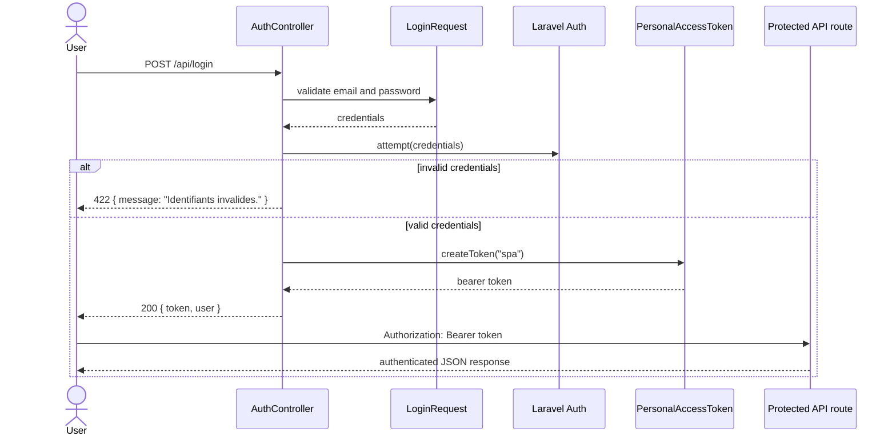

Rules:

- Login is rate limited.
- Tokens are stored in the Mongo `personal_access_tokens` collection.
- API consumers must send `Authorization: Bearer <token>`.

## 3. Logout Workflow

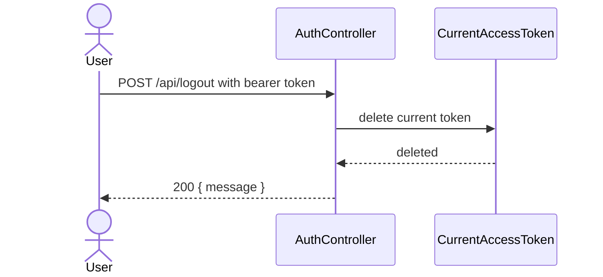

Rules:

- Logout revokes only the token used by the request.
- Other tokens for the same user are not revoked.

## 4. Notification Workflow

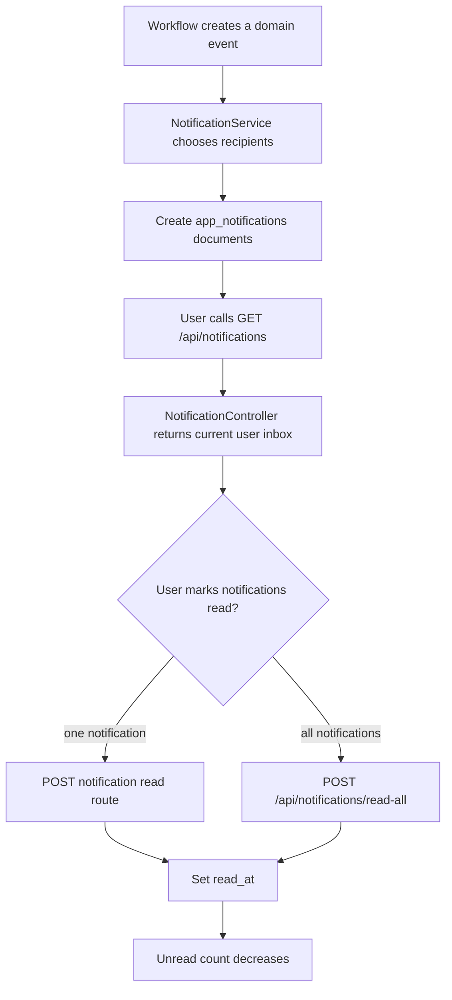

Rules:

- A user can read and update only their own notifications.
- Notification data is stored as structured metadata in `data`.

## 5. Public Event Browsing Workflow

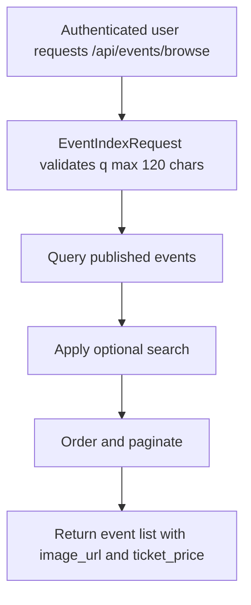

Rules:

- Browsing is authenticated.
- Only published events are listed.
- Money is exposed as `ticket_price`; storage remains `ticket_price_cents`.

## 6. Event Detail Visibility Workflow

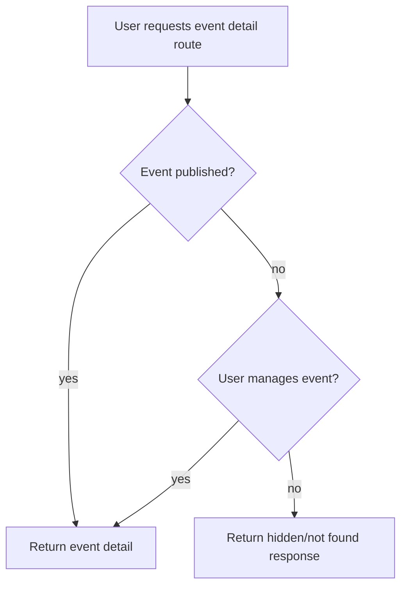

Rules:

- Published events are visible to authenticated users.
- Draft or pending events are visible only to admins or managing organizers.

## 7. Organizer Event Creation Workflow

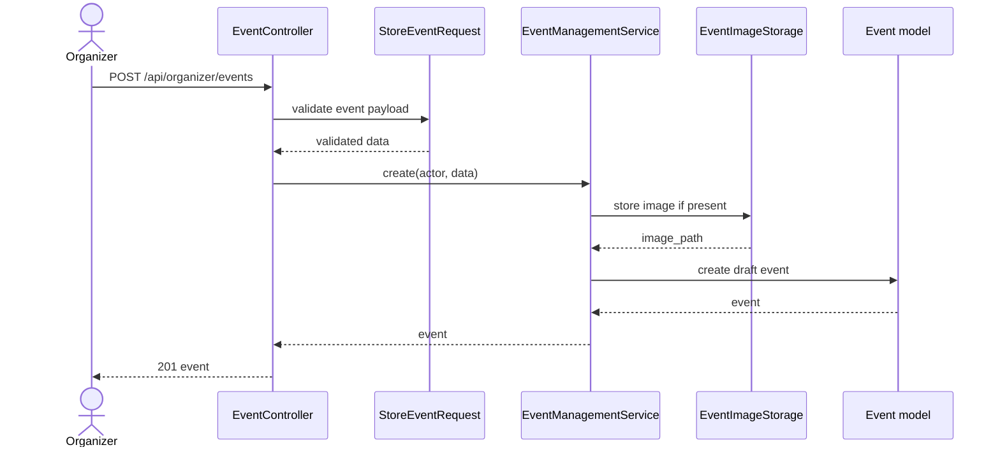

Rules:

- Organizer-created events remain `draft`.
- Organizers cannot directly publish by sending `status=published`.
- Image data is validated before storage.

## 8. Admin Event Creation Workflow

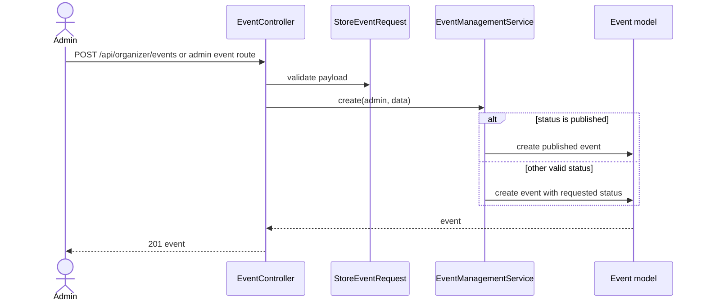

Rules:

- Admins can create published events.
- Admins can later assign organizers.

## 9. Event Update Workflow

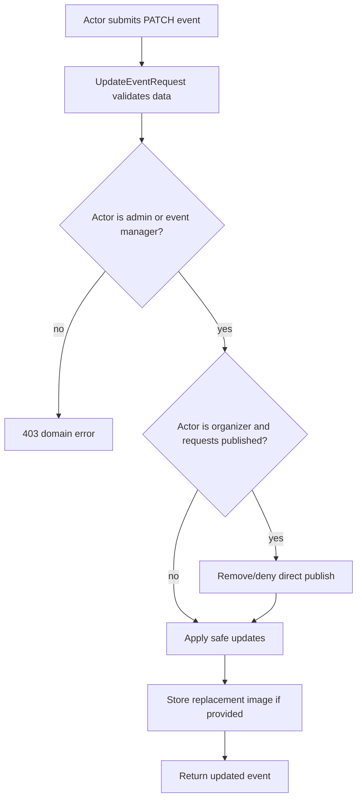

Rules:

- Ownership is checked in the service.
- Organizer publish must go through publication request and admin approval.
- Capacity has its own stricter workflow.

## 10. Capacity Update Workflow

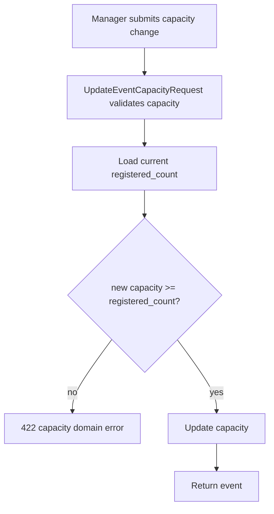

Rules:

- Capacity can never be reduced below the number of registered participants.
- This keeps existing registrations valid.

## 11. Publication Request Workflow

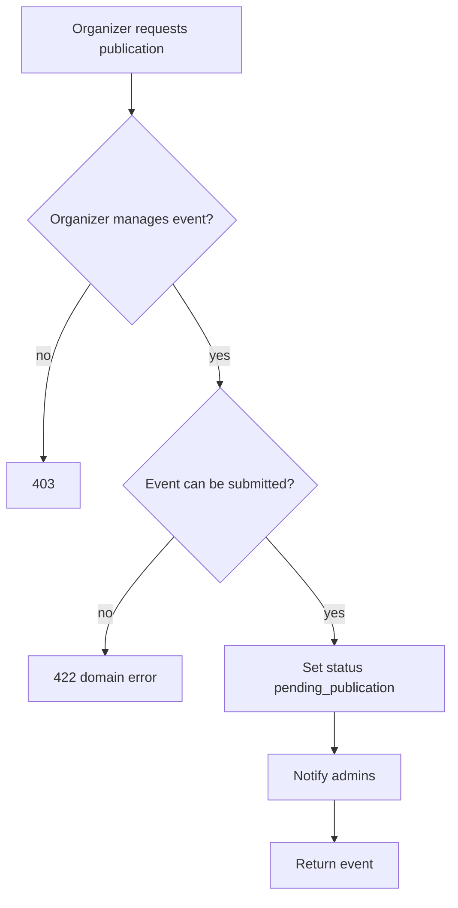

Rules:

- Publication is a two-step workflow for organizers.
- Admin approval is required before participants can register.

## 12. Publication Approval Workflow

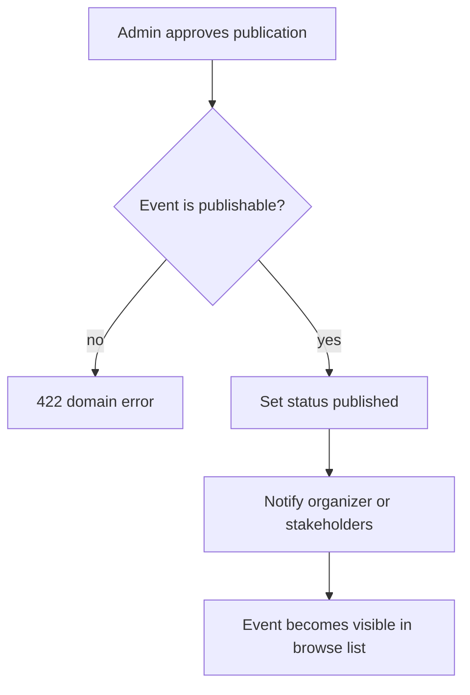

Rules:

- Only admins can approve publication.
- Published events become registerable if other registration rules pass.

## 13. Admin Organizer Assignment Workflow

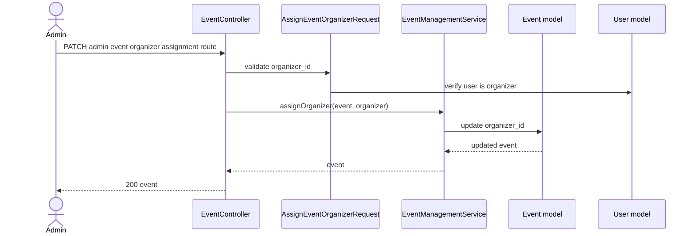

Rules:

- The assigned user must have the organizer role.
- Admins can still manage all events even when not assigned.

## 14. Client Event Request Submission Workflow

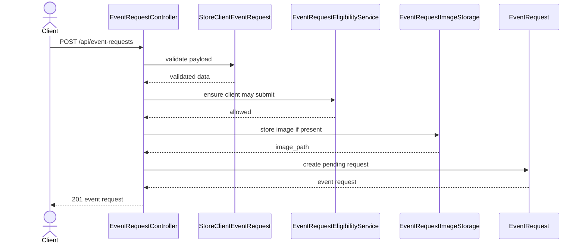

Rules:

- A client with a pending request is blocked from submitting another.
- A client with an active event is blocked from submitting another.
- Contact fields default from the authenticated client when omitted.

## 15. Client Event Request Deletion Workflow

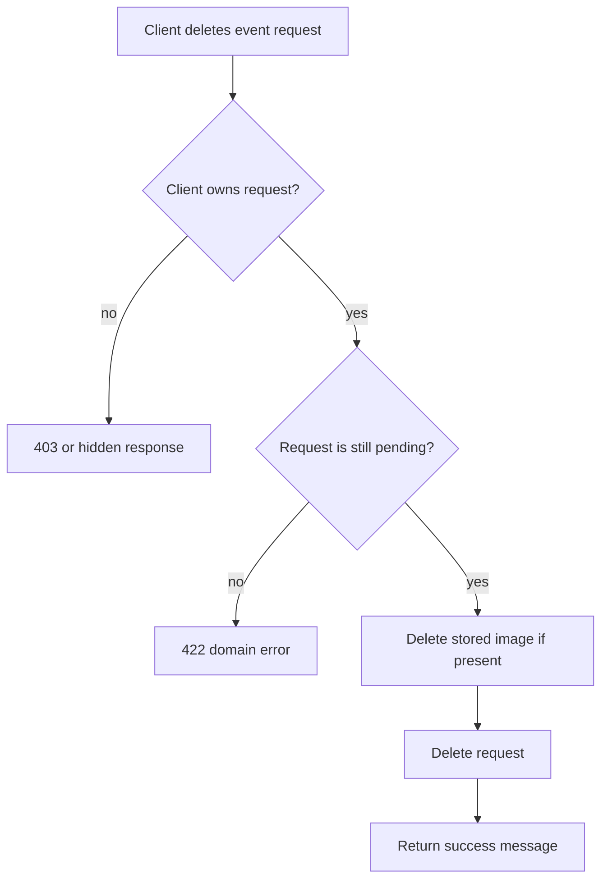

Rules:

- Reviewed requests are audit history and cannot be deleted by the client.

## 16. Admin Event Request Approval Workflow

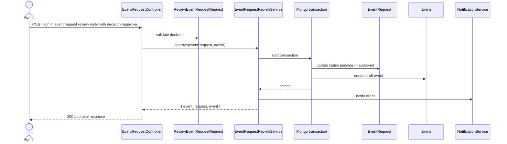

Rules:

- Approval is atomic with draft event creation.
- The status update is conditional so a reviewed request cannot be reviewed again.

## 17. Admin Event Request Rejection Workflow

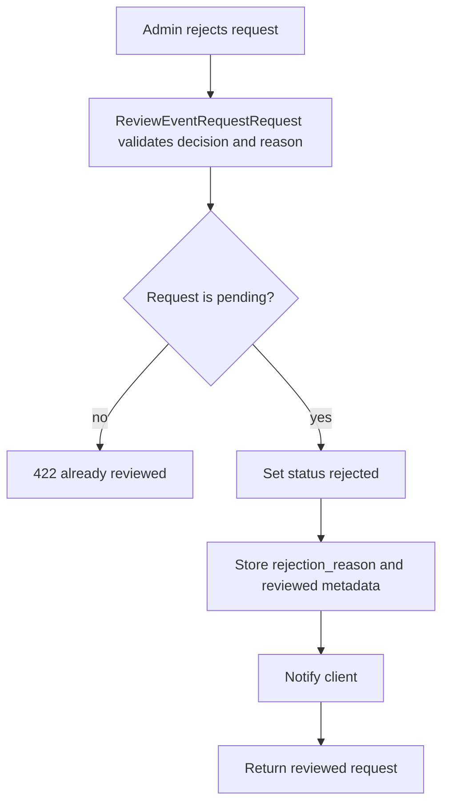

Rules:

- Rejection requires a rejection reason.
- No event is created.

## 18. Event Task Workflow

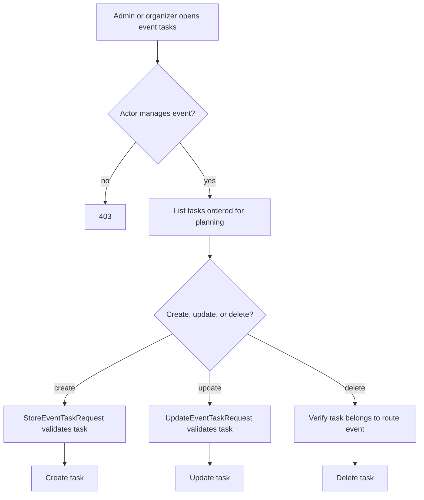

Rules:

- Tasks are always scoped to an event.
- A task from a different event is rejected even if the user manages both events.

## 19. Event Activity Workflow

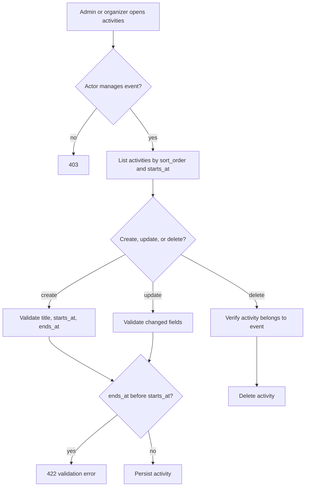

Rules:

- Activities define the event timeline.
- End time cannot be earlier than start time.

## 20. Participant Registration Workflow

```mermaid
sequenceDiagram
    actor P as Participant
    participant API as RegistrationController
    participant Service as ParticipantRegistrationService
    participant Core as RegistrationService
    participant Mongo as Mongo transaction
    participant Event as Event
    participant Registration as Registration
    participant Payment as Payment
    participant Notify as NotificationService

    P->>API: POST event registration route
    API->>Service: register(participant, event)
    Service->>Core: register(participant, event)
    Core->>Mongo: start transaction
    Mongo->>Event: verify published and capacity available
    Mongo->>Registration: check duplicate event/user
    Mongo->>Event: conditional increment registered_count
    Mongo->>Registration: create registration with unique ticket_code
    alt free event
        Mongo->>Payment: create completed free payment
    end
    Mongo-->>Core: commit
    Core->>Notify: notify admins/organizers
    Core-->>Service: registration
    Service-->>API: registration
    API-->>P: 201 registration
```

Rules:

- The event must be published.
- `registered_count` increments only when capacity is still available.
- `registrations_event_user_unique` prevents duplicate registrations.
- `registrations_ticket_code_unique` prevents duplicate ticket codes.

## 21. Full Capacity Registration Failure Workflow

```mermaid
flowchart TD
    A[Participant requests registration] --> B[Load current event]
    B --> C{registered_count < capacity?}
    C -- no --> D[Return 422 event full]
    C -- yes --> E[Try atomic increment where count < capacity]
    E --> F{increment succeeded?}
    F -- no --> D
    F -- yes --> G[Create registration]
```

Rules:

- The initial capacity check is not enough by itself.
- The conditional update is the race-condition protection.

## 22. Duplicate Registration Failure Workflow

```mermaid
flowchart TD
    A[Participant requests registration] --> B[Service checks existing event/user registration]
    B --> C{Existing registration found?}
    C -- yes --> D[Return 422 with existing registration]
    C -- no --> E[Create registration]
    E --> F{Mongo unique index conflict?}
    F -- no --> G[Registration succeeds]
    F -- yes --> H[Translate duplicate key into user-friendly 422]
```

Rules:

- The service check gives a clean user experience.
- The unique index is the final database-level protection.

## 23. Payment Workflow

```mermaid
sequenceDiagram
    actor P as Participant
    participant API as RegistrationController
    participant Service as ParticipantRegistrationService
    participant Core as RegistrationService
    participant Mongo as Mongo transaction
    participant Registration as Registration
    participant Payment as Payment
    participant Notify as NotificationService

    P->>API: POST registration payment route
    API->>Service: pay(participant, registration)
    Service->>Core: pay(registration)
    Core->>Mongo: start transaction
    Mongo->>Registration: update pending -> paid
    Mongo->>Payment: create completed card_mock payment
    Mongo-->>Core: commit
    Core->>Notify: notify admins/organizers
    Core-->>API: paid registration
    API-->>P: 200 registration
```

Rules:

- Already paid registrations return a domain response instead of double-charging.
- Payments are stored as integer cents.

## 24. Participant Cancellation Workflow

```mermaid
flowchart TD
    A[Participant deletes registration] --> B{Participant owns registration?}
    B -- no --> C[403]
    B -- yes --> D{payment_status is paid?}
    D -- yes --> E[422 cannot cancel paid registration]
    D -- no --> F[Delete registration]
    F --> G[Decrement event registered_count if above zero]
    G --> H[Return success message]
```

Rules:

- Paid registrations cannot be cancelled through this endpoint.
- Cancelling an unpaid registration frees capacity.

## 25. Ticket Download Workflow

```mermaid
flowchart TD
    A[Participant requests ticket] --> B{Owns registration?}
    B -- no --> C[403]
    B -- yes --> D{Registration paid?}
    D -- no --> E[422 unpaid ticket]
    D -- yes --> F[Build JSON ticket payload]
    F --> G[Stream ticket download]
```

Rules:

- Tickets are available only after payment.
- The current implementation returns a JSON ticket file.

## 26. Staff Registration Management Workflow

```mermaid
flowchart TD
    A[Organizer or admin opens registration management] --> B{Actor role}
    B -- admin --> C[Can query registrations for all events]
    B -- organizer --> D[Can query only managed events]
    C --> E[Optional event_id filter validated as Mongo ObjectId]
    D --> E
    E --> F[List registrations with event/user data]
    F --> G{Delete registration?}
    G -- yes --> H{Registration unpaid and actor manages event?}
    H -- no --> I[403 or 422 domain error]
    H -- yes --> J[Delete registration and decrement count]
```

Rules:

- Organizer views are scoped to their own events.
- Admin views are global.
- Staff deletion is still blocked for paid registrations.

## 27. Feedback Submission Workflow

```mermaid
sequenceDiagram
    actor P as Participant
    participant API as FeedbackController
    participant Request as StoreFeedbackRequest
    participant Service as FeedbackService
    participant Registration as Registration
    participant Feedback as Feedback
    participant Notify as NotificationService

    P->>API: POST event feedback route
    API->>Request: validate rating and comment
    API->>Service: submit(participant, event, data)
    Service->>Registration: verify paid registration
    alt no paid registration
        Service-->>API: 403 domain error
    else eligible
        Service->>Feedback: create pending feedback
        Service->>Notify: notify admins/organizers
        Service-->>API: feedback
        API-->>P: 201 feedback
    end
```

Rules:

- Only paid participants can submit feedback.
- Feedback starts as `pending`.
- A unique index prevents duplicate feedback for the same event and user.

## 28. Feedback Moderation Workflow

```mermaid
flowchart TD
    A[Admin reviews pending feedback] --> B{Approve or delete?}
    B -- approve --> C[Set status approved]
    C --> D[Notify author and event client when relevant]
    D --> E[Feedback becomes visible publicly]
    B -- delete --> F[Delete feedback]
    F --> G[Feedback removed from all lists]
```

Rules:

- Public feedback lists show approved feedback.
- Admins can see pending feedback for moderation.

## 29. Admin Stats Workflow

```mermaid
flowchart TD
    A[Admin calls /api/admin/stats] --> B[Count users by role]
    B --> C[Count events by status]
    C --> D[Count pending requests and feedback]
    D --> E[Sum completed payment cents]
    E --> F[Return dashboard payload]
```

Rules:

- Revenue uses completed payments only.
- Amounts are summed from cents, not decimal display fields.

## 30. Client Stats Workflow

```mermaid
flowchart TD
    A[Client calls /api/client/stats] --> B[Find client event requests]
    B --> C[Find events created from approved requests]
    C --> D[Group requests by status]
    D --> E[Sum revenue for owned/requested events]
    E --> F[Return client dashboard payload]
```

Rules:

- Client stats are limited to that client's requests/events.
- Client revenue is derived from completed payments on their events.

## 31. User Administration Workflow

```mermaid
sequenceDiagram
    actor Admin
    participant API as UserAdminController
    participant Request as User FormRequest
    participant Service as UserWriteService
    participant User as User model

    Admin->>API: GET/POST/PATCH/DELETE /api/admin/users
    API->>Request: validate role, email, password, filters
    API->>Service: create/update/delete user
    alt self delete requested
        Service-->>API: 422 self-delete blocked
    else valid operation
        Service->>User: persist change
        User-->>Service: user or delete result
        Service-->>API: result
        API-->>Admin: JSON response
    end
```

Rules:

- Admins manage users.
- Self-delete is blocked.
- Email uniqueness is enforced by validation and Mongo index.

## 32. Health Check Workflow

```mermaid
flowchart TD
    A[GET /api/health] --> B[Check MongoDB connection]
    B --> C[Check Redis connection]
    C --> D{All dependencies ok?}
    D -- yes --> E[200 status ok]
    D -- no --> F[503 status degraded]
    E --> G[Return service status report]
    F --> G
```

Rules:

- Health checks are public.
- The endpoint is used by Docker healthchecks and local smoke testing.

## 33. Cross-Cutting API Middleware Workflow

```mermaid
flowchart TD
    A[API request enters Laravel] --> B[AttachRequestId middleware]
    B --> C[Role/auth middleware if route requires it]
    C --> D[Controller or FormRequest]
    D --> E[Response generated]
    E --> F[ApplyApiSecurityHeaders middleware]
    F --> G[JSON response with request id and security headers]
```

Rules:

- API errors return JSON.
- A safe inbound `X-Request-Id` is reused; otherwise a new request id is generated.
- Security headers are attached to success and error responses.

## 34. Workflow Ownership Summary

| Workflow | Main Actor | Main Service | Main Collections |
| --- | --- | --- | --- |
| Register account | visitor | `UserWriteService` | `users`, `personal_access_tokens` |
| Login/logout | any user | Laravel Auth/Sanctum | `users`, `personal_access_tokens` |
| Browse events | authenticated user | `EventManagementService` and query layer | `events` |
| Create/update event | admin, organizer | `EventManagementService` | `events`, `users` |
| Request publication | organizer | `EventManagementService` | `events`, `app_notifications` |
| Approve publication | admin | `EventManagementService` | `events`, `app_notifications` |
| Submit event request | client | `EventRequestSubmissionService` | `event_requests`, `events` |
| Review event request | admin | `EventRequestReviewService` | `event_requests`, `events` |
| Manage tasks | admin, organizer | `EventTaskService` | `event_tasks`, `events` |
| Manage activities | admin, organizer | `EventActivityService` | `event_activities`, `events` |
| Register for event | participant | `RegistrationService` | `events`, `registrations`, `payments` |
| Pay registration | participant | `RegistrationService` | `registrations`, `payments` |
| Cancel registration | participant | `RegistrationService` | `registrations`, `events` |
| Staff manage registrations | admin, organizer | `StaffRegistrationService` | `registrations`, `events` |
| Submit feedback | participant | `FeedbackService` | `feedbacks`, `registrations`, `events` |
| Moderate feedback | admin | `FeedbackService` | `feedbacks`, `app_notifications` |
| Notifications | all authenticated users | `NotificationService` | `app_notifications` |
| Stats | admin, client | `AdminStatsService`, `ClientStatsService` | `users`, `events`, `event_requests`, `registrations`, `payments`, `feedbacks` |
